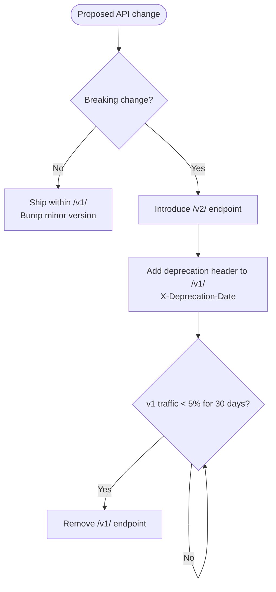
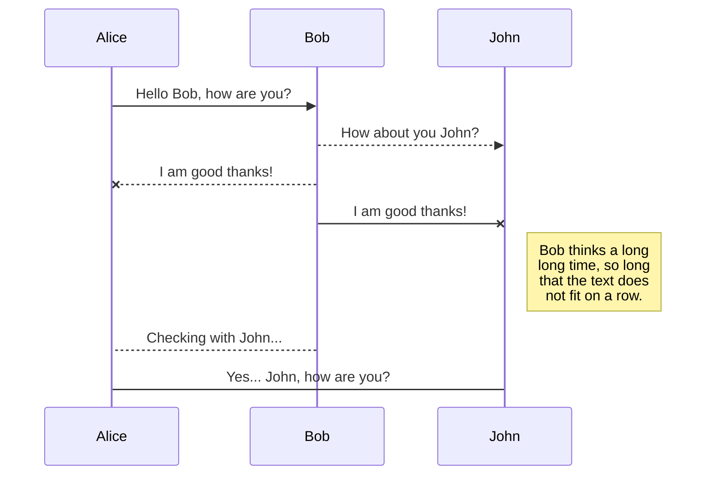

# API Design v2 Proposal

> **Status**: Draft — under review

## Overview

This proposal outlines the second major revision of our internal REST API, focusing on
consistency, versioning, and backwards compatibility.

## Background

The current API (v1) was designed rapidly and has accumulated several inconsistencies:

- Mixed snake_case and camelCase field names
- Inconsistent error response shapes
- No standard pagination envelope
- Missing rate limit headers on several endpoints

## Versioning Strategy

A change is breaking if any existing client would need to update to stay functional.
Non-breaking changes ship within the current version; breaking changes require a new version.

## Request / Response Sequence

