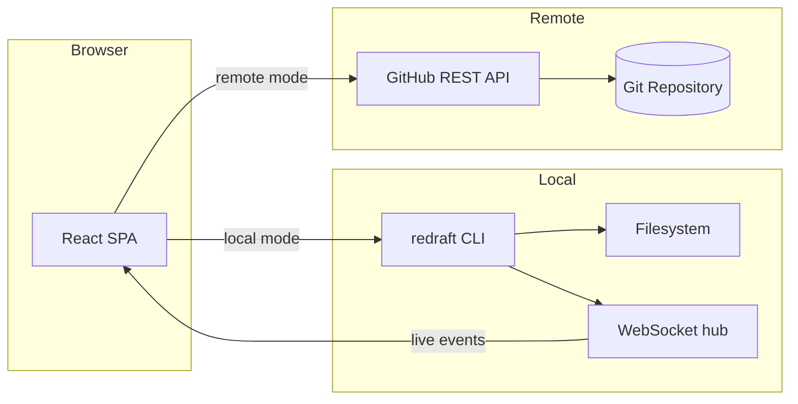
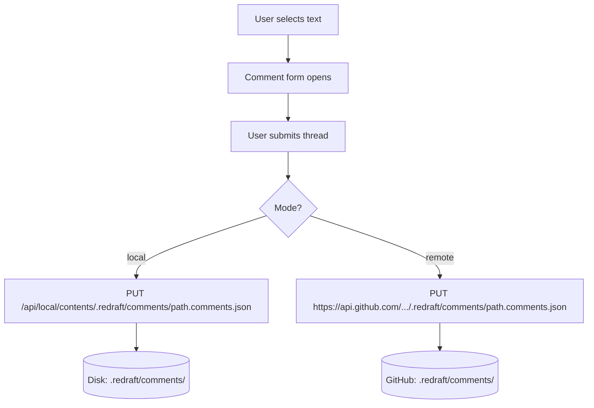
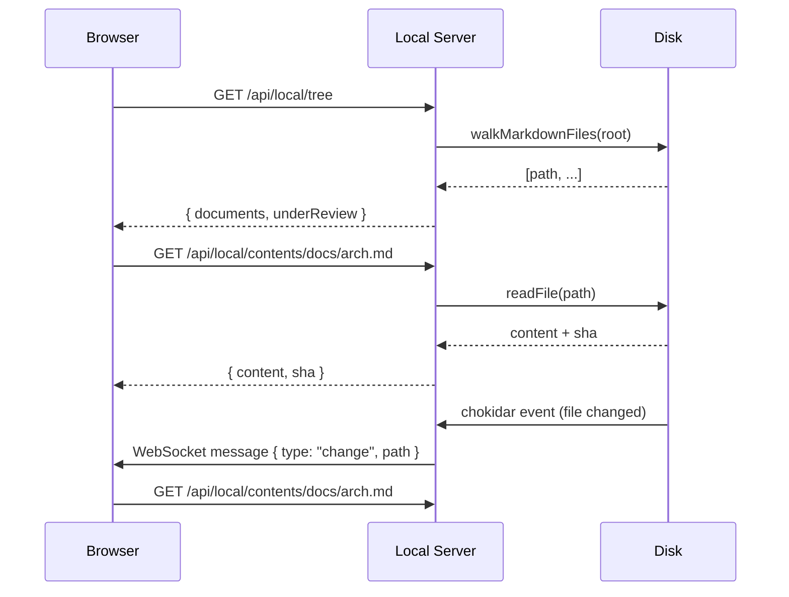

# System Architecture

## Overview

The system is split into three layers: a React single-page application, a local Hono
server for filesystem access, and the GitHub REST API for remote collaboration.

## Local Mode

In local mode the CLI (`npx redraft [directory]`) starts a Hono HTTP server that:

1. Serves the pre-built React SPA
2. Exposes `/api/local/*` routes that mirror the GitHub Contents API shape
3. Pushes filesystem change events to the browser via WebSocket

The browser detects local mode from `window.__REDRAFT_LOCAL__` injected into `index.html`
and skips the GitHub PAT auth gate.

## Remote Mode

In remote mode the browser talks directly to `https://api.github.com` using a
personal access token supplied by the user. No server component is needed.

## Comment Storage

Comment sidecars are stored at `.redraft/comments/<mirrored-path>.comments.json`
relative to the repository root. This keeps review state co-located with the repo
but separate from the document content.

## Data Flow

