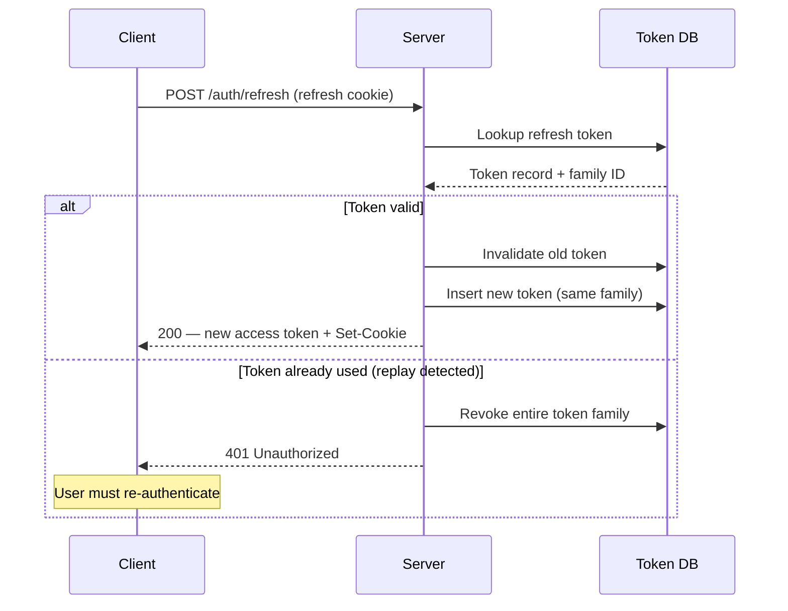
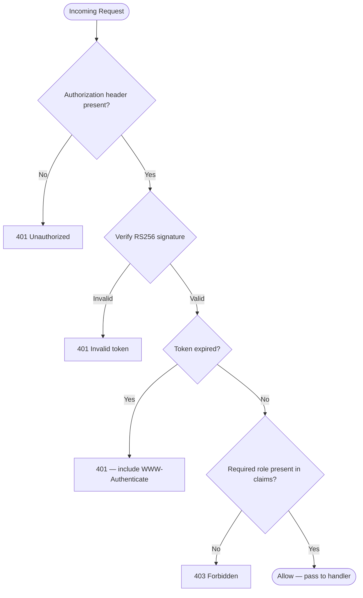

# Authentication Overhaul Proposal

## Summary

Replace the current session-cookie authentication with a token-based system using
short-lived JWTs and refresh tokens stored in HttpOnly cookies.

## Motivation

Current pain points:

- Sessions are stored server-side, creating scaling bottlenecks
- No machine-to-machine auth story for CI/CD and automation
- Token revocation is coarse-grained (full logout only)
- No multi-device session management

## Proposed Architecture

### Access Token

- Format: signed JWT (RS256)
- TTL: **15 minutes**
- Claims: `sub` (user ID), `roles`, `iat`, `exp`
- Storage: **memory only** (JavaScript variable, never persisted)

### Refresh Token

- Format: opaque random string (32 bytes, hex-encoded)
- TTL: **30 days**, sliding window on use
- Storage: **HttpOnly, Secure, SameSite=Strict cookie**
- One active refresh token per device session

### Token Rotation

On every `/auth/refresh` call:
1. Validate incoming refresh token against DB
2. Issue new access token + new refresh token
3. Invalidate old refresh token (single-use rotation)
4. If old token already invalidated → suspect replay → revoke entire family

## Endpoints

| Method | Path | Description |
|--------|------|-------------|
| POST | `/auth/login` | Password or SSO → returns access + sets refresh cookie |
| POST | `/auth/refresh` | Exchange refresh cookie → new access token |
| POST | `/auth/logout` | Revoke refresh token; clear cookie |
| GET | `/auth/sessions` | List active device sessions |
| DELETE | `/auth/sessions/:id` | Revoke a specific session |

## Request Authorization Flow

Every protected endpoint runs this decision tree before reaching business logic:

## Security Considerations

- Refresh token family tracking prevents silent replay attacks
- HttpOnly cookie prevents XSS token theft
- 15-minute access token TTL limits blast radius of a leaked token
- Rotate signing keys every 90 days; support key rollover with a 24-hour overlap

## Rollout Plan

| Week | Work |
|------|------|
| 1–2 | Implement token service, DB schema |
| 3–4 | Integrate with existing auth middleware |
| 5 | Canary deploy to 10% of traffic |
| 6 | Full deploy; monitor refresh error rates |
| 7 | Remove legacy session code |

## Risks

- **Refresh token loss**: If HttpOnly cookie is cleared (e.g., browser data wipe),
  user must re-authenticate. Acceptable — same UX as current logout.
- **Clock skew**: JWT validation requires clocks within 30s. NTP enforcement already in place.
