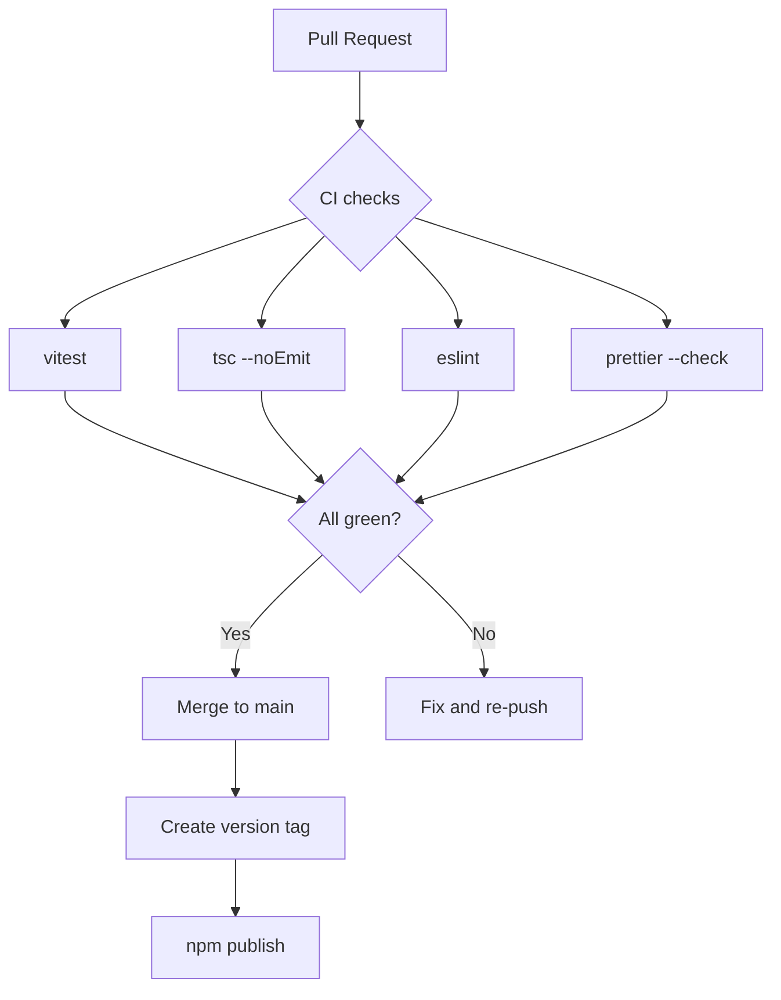

# Deployment Guide

## Production Build

The project ships a combined tarball containing both the React SPA assets and the
compiled server CLI.

```bash
npm run build
```

This runs `vite build` followed by `esbuild` to produce:

| Output | Description |
|--------|-------------|
| `dist/` | Vite-bundled frontend (served as static files) |
| `dist-server/cli.mjs` | Self-contained server entry (no `tsx` required at runtime) |

## Publishing to npm

```bash
npm version patch
npm publish
```

The published package includes `bin/`, `dist/`, and `dist-server/`. After publishing,
end users can run:

```bash
npx redraft-local
```

or install globally:

```bash
npm install -g redraft-local
redraft-local
```

## CI / CD



## Environment Variables

| Variable | Default | Description |
|----------|---------|-------------|
| `VITE_BASE_PATH` | `/` | Base path for the SPA (useful for GitHub Pages) |
| `PORT` | `4200` | Port for the local server |

## Health Check

The local server does not expose a dedicated health endpoint. Use the presence of
a response on the root path (`GET /`) as a liveness indicator.
